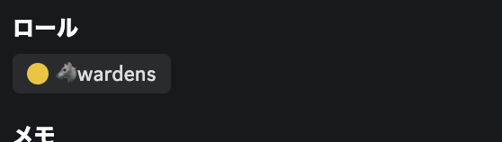

# Code4renaで狼ロールをGetする方法

## やり方

- 1. Code4renaへ登録する
- 2. Code4renaのDiscordへjoinする
- 3. `#🐺i-want-to-be-a-warden`チャンネル内で `hi`とコメントする。

### 1. Code4renaへ登録する

まずは、Code4renaでアカウント情報を登録します。ホームページに行きましょう!  

[ホームページ](https://code4rena.com/)

右上のボタンに"CONNECT"というボタンがあるのでその中からMETAMASKのマークを選んでクリックします。  

そうするとSignを求められるのでSignしましょう！

次に登録に必要な情報を入力するためのフォームが出てくるので必要事項を記入して登録を済ませましょう！

うまくいけば右上に自分が設定したアバターの写真が表示されているはずです！

### 2. Code4renaのDiscordへjoinする

登録作業が完了したらDiscordにjoinしましょう！！URLは下記の通りです。(私の場合は犬🐶の写真にしました。)  

https://discord.com/invite/code4rena   

うまくいけば下記のようなページに遷移します。

### 3. `#🐺i-want-to-be-a-warden`チャンネル内で `hi`とコメントする。

DiscordにjoinしたらVerifyを済ませて、ロールをGetします。  
チャンネルの中に`#start-here`というチャンネルがあるのでそこを見にいきます。

そうすると狼ロールをゲットするための方法が記載されています！

この指示に従って、`#🐺i-want-to-be-a-warden`チャンネル内で `hi`とコメントしましょう！  

しばらく時間がかかりますが、問題なければ下記のようにロールが付与されます！！

完了です！！  
皆で`Bug Bounty`になりましょう！！！